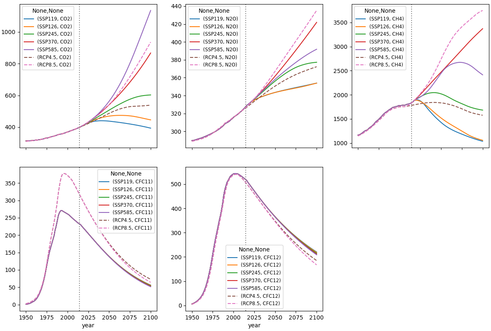

WRF Greenhouse Gases (GHG) concentration files
==============================================

These are scripts to retrieve and create CMIP6 Shared Socioeconomic Pathways (SSP) GHG concentration
files for use in the Weather Research & Forecasting ([WRF](https://www2.mmm.ucar.edu/wrf/users)) modelling system.

This is a comparison of the new SSP files created and the some of the existing concentration pathways (RCPs) files, as retrieved from WRF v4.2.2:

